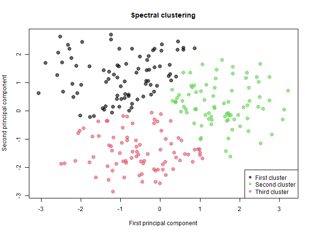

# __Disease subtype discovery using multi-omics data integration__

The ongoing decrease in cost and processing time of omics-based methodologies
has led to a significant increase in the volume of big data, shifting research
methodologies from hypothesis-driven investigations to __data-driven__ analyses.

To achieve a comprehensive understanding of human health and diseases, it is
necessary to interpret the intricate molecular complexities and variations across
multiple levels, including the genome, epigenome, transcriptome, proteome, and
metabolome. The recollection of data at these various levels is referred to as __multi-omics data__.

In this work, we apply and compare different approaches to perform disease subtype discovery from multi-omics data, in the context of __prostate cancer__.

- __Experiments__ can be reproduced from [`bio_2023.Rmd`](https://github.com/aleceress/bioinformatics_project/blob/master/bio_2023.Rmd)
- A complete description of the __project__ can be found in [report.pdf](https://github.com/aleceress/bioinformatics_project/blob/master/report.pdf)

